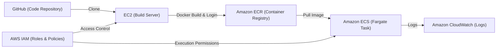

# AWS ECS Fargate Node App (aws-ecs-fargate-node-app) 🚀
### Enterprise-grade Task Orchestration Node.js App on AWS ECS Fargate & Amazon ECR

[](https://github.com)
[](https://www.docker.com)
[](https://aws.amazon.com/ecr/)
[-FF9900?logo=amazon-ecs&style=for-the-badge)](https://aws.amazon.com/ecs/)
[](https://nodejs.org)

**DevFlow Orchestrator** is a streamlined, containerized Node.js Web Application designed for scalable, cloud-native deployments. This guide details how to run the application locally using Docker Compose, build and publish images using an AWS EC2 Build Server, and orchestrate the workload on serverless **AWS ECS Fargate** with logs forwarded to **Amazon CloudWatch**.

---

## 🛠 Architecture Overview

The system architecture outlines the flow of the application from commit to serverless execution:



1. **Development & Storage**: The code is committed to GitHub.
2. **Build Server**: An AWS EC2 instance pulls the code, builds the container image, and authenticates with AWS ECR.
3. **Container Registry**: Amazon ECR hosts the versioned container images.
4. **Serverless Orchestration**: Amazon ECS pulls the image from ECR and runs it as a serverless Fargate Task.
5. **Security & Governance**: AWS IAM governs access permissions for the build server and task executor.
6. **Observability**: Container logs are streamed directly to Amazon CloudWatch for real-time monitoring.

---

## 💻 Local Development

Run the entire stack locally with a single command.

### Prerequisites
*   [Docker](https://docs.docker.com/get-docker/) installed.
*   [Docker Compose](https://docs.docker.com/compose/install/) installed.

### Run the App
1.  **Clone the repository** (if not already done):
    ```bash
    git clone https://github.com/Nishan109/aws-ecs-fargate-node-app.git
    cd aws-ecs-fargate-node-app
    ```
2.  **Start container stack**:
    ```bash
    docker-compose up -d --build
    ```
3.  **Access the application**:
    Open [http://localhost:8000/tasks](http://localhost:8000/tasks) in your browser.

---

## ☁️ AWS ECS Fargate Deployment Guide

Follow this step-by-step pipeline to deploy your containerized application to AWS production.

### Step 1: Set Up the EC2 Build Server
The EC2 build machine acts as the CI builder to package the Docker image and push it to AWS ECR.

1.  **Launch EC2 Instance**:
    *   **Name**: `Build-Server`
    *   **OS**: `Ubuntu 24.04 LTS (HVM)` (free-tier eligible)
    *   **Instance Type**: `t2.micro` or `t3.micro`
    *   **Security Group**: Enable **SSH** access restricted to your IP address.
2.  **Access and Prepare EC2**:
    ```bash
    ssh -i /path/to/key.pem ubuntu@YOUR_EC2_PUBLIC_IP
    ```
3.  **Install Git and Docker**:
    ```bash
    sudo apt-get update -y
    sudo apt-get install git docker.io -y
    sudo usermod -aG docker ubuntu
    newgrp docker
    ```

---

### Step 2: Configure AWS IAM Roles & Permissions
AWS IAM permissions are crucial to connect the build pipeline and container runtime securely.

1.  **Create Build Server Role (`EC2-ECR-Publish-Role`)**:
    *   Attach the policy: `AmazonEC2ContainerRegistryPowerUser`.
    *   Attach this role to your EC2 Instance (**Instance state** -> **Security** -> **Modify IAM role**).
2.  **Create Task Execution Role (`ECS-Task-Execution-Role`)**:
    *   Trusted Entity: `Elastic Container Service Task`.
    *   Attach the policy: `AmazonECSTaskExecutionRolePolicy` (enables pulling images and creating CloudWatch log groups).

---

### Step 3: Create ECR Repository & Push Docker Image
1.  **Create an ECR repository**:
    *   Navigate to **Amazon ECR** -> **Repositories** -> **Create repository**.
    *   Select **Private** or **Public**.
    *   Name: `node-app`
2.  **Authenticate & Push from EC2**:
    *   Clone your repository on the EC2 Build Server:
        ```bash
        git clone https://github.com/<YOUR_USERNAME>/aws-ecs-fargate-node-app.git
        cd aws-ecs-fargate-node-app
        ```
    *   Log in to ECR:
        ```bash
        aws ecr get-login-password --region <YOUR_AWS_REGION> | docker login --username AWS --password-stdin <ECR_REGISTRY_URI>
        ```
    *   Build, tag, and push the image:
        ```bash
        docker build -t node-app .
        docker tag node-app:latest <ECR_REGISTRY_URI>/node-app:latest
        docker push <ECR_REGISTRY_URI>/node-app:latest
        ```

---

### Step 4: Deploy on AWS ECS (Fargate)
1.  **Create ECS Cluster**:
    *   Navigate to **Amazon ECS** -> **Clusters** -> **Create cluster**.
    *   Name: `devflow-cluster`
    *   Infrastructure: **AWS Fargate (serverless)**.
2.  **Create Task Definition**:
    *   Go to **Task Definitions** -> **Create new task definition**.
    *   Family Name: `devflow-orchestrator-td`
    *   Launch Type: **AWS Fargate**
    *   Task execution role: `ECS-Task-Execution-Role`
    *   **Container Details**:
        *   Name: `node-container`
        *   Image URI: `<ECR_REGISTRY_URI>/node-app:latest`
        *   Port Mappings: Container port `8000`, Protocol `tcp`.
        *   Log configuration: Ensure **AWS CloudWatch** (`awslogs`) is enabled to capture logs.
3.  **Run Task**:
    *   Inside the cluster -> **Tasks** -> **Run Task**.
    *   Launch Type: **Fargate**.
    *   Family: `devflow-orchestrator-td`.
    *   Networking: Use default VPC, select Public Subnets, and ensure **Public IP** is **Enabled**.

---

### Step 5: Configure Security Group (Crucial!)
To allow web traffic to the running Node.js app:

1.  Select the **Security Group** of the active ECS task.
2.  Add an **Inbound Rule**:
    *   **Type**: `Custom TCP`
    *   **Port Range**: `8000`
    *   **Source**: `Anywhere-IPv4` (`0.0.0.0/0`)
3.  Save the changes.

---

### Step 6: Verify and Monitor
1.  Navigate to your ECS Cluster -> **Tasks** tab -> Select the running task.
2.  Copy the task's **Public IP** from the configuration panel.
3.  Open a browser and visit:
    ```text
    http://<YOUR_ECS_TASK_PUBLIC_IP>:8000/tasks
    ```
4.  Check real-time application logs in **Amazon CloudWatch** -> **Log groups** under `/ecs/devflow-orchestrator-td`.
